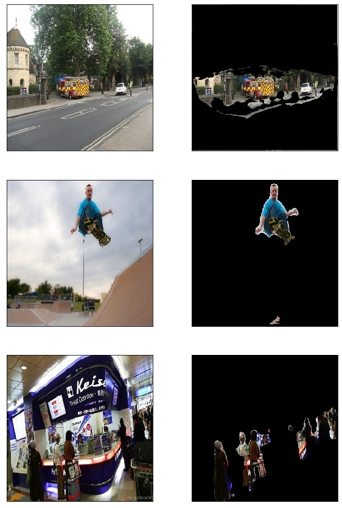

# Background Remover

## Overview

To remove objects from images, there are several algorithms:

* **Clustering**
    * It usually partition the image into several clusters.
    * K-means is a well known method.
* **Thresholding**
    * The simplest method.
    * The key is to select a threshold value and then compare to each pixel.
* **Region Growing**
    * Mainly relies on the that the neighbors in same region should be similar.
* **Deep Learing**
    * It has an enormous achievement on this field.
    * Usually be implemented with convolutional layers.

All of them are very powerful and interesting, but we'll implement the remover with **deep learing**. 

## CNN (Convolutional Neural Network)

In deep learning, tasks about image are often solved with **CNN**. <br>
CNN has some powerful benefits:
* It takes important features from images, such as edges.
* In deep learning, it reduces the number of parameters, but has better performance.
* Network can be calculated on GPUs more faseter than on CPUs.

## Model Explain

There are many models for image segmentation made by well known organizations and researchers. <br>
We'll use **Linknet** in this example.

### U-Net

In traditional models, layers are usually connected to the next one. <br>
While more maxpooling layers inputs go through, the more features are lost.

U-Net solve this problem in a clever way. <br>


It add outputs from encoder to layers of decoder directly, so the decoder can use more details.

## Prepare Dataset

Before building model, we should prepare our data first. <br>
We'll use images from **COCO dataset** to train the model.

Download train, validation and test dataset.


```python
!wget http://images.cocodataset.org/zips/train2017.zip data/
!wget http://images.cocodataset.org/zips/val2017.zip data/
!wget http://images.cocodataset.org/zips/test2017.zip data/
```

Extract all datasets.


```python
!unzip train2017.zip
!unzip val2017.zip
!unzip test2017.zip
```

To use COCO dataset for training, we need **annotation** files to get masks of segmentation.


```python
!wget http://images.cocodataset.org/annotations/annotations_trainval2017.zip
!unzip annotations_trainval2017.zip
```

Now, you should have three datasets and several json files in annotation folder. <br>
Next, we have to preprocess the images by creating mask images.

Load data information from annotations.


```python
from pycocotools.coco import COCO
```


```python
# annotations/instances
# {dataset}2017.json
path = "annotations/instances_train2017.json"
data = COCO(path)
```

We only need images that contain person.


```python
import numpy as np
import cv2
from os.path import join
```


```python
i = 0
images, masks = [], []
for imgId in data.getImgIds():
    
    img = data.loadImgs(imgId)[0]
    
    valid = False
    anns = data.loadAnns(data.getAnnIds(imgId))

    mask = np.zeros((img["height"], img["width"]), dtype=np.byte)
    for ann in anns:
        
        # category id of person is 1
        if ann["category_id"] == 1:
            seg = data.annToMask(ann)
            mask += seg
            valid = True
    
    # if contains person
    if valid:
        
        file_name = img["file_name"]
        # {dataset}2017
        frame = cv2.imread(join("train2017", file_name))
        # frames/{dataset}
        cv2.imwrite(join("data/frames/train", file_name), frame)
        # masks/{dataset}
        cv2.imwrite(join("data/masks/train", file_name), mask)
        i += 1
```


## Build Model

In this example, we'll use 8000 samples for training, 1600 for validation.


```python
# input image shape
img_shape = (256, 256)
batch_size = 16
n_train = 500 * batch_size
n_val = 100 * batch_size
```


```python
import cv2
import glob
from os.path import join, expanduser
import numpy as np
```


```python
# this handles all requests for data
class generator:
    
    def __init__(self, frames_dir, masks_dir, img_shape, n_data=None):
        
        frames_path = glob.glob(join(frames_dir, "*.jpg"))
        self.frames_path = sorted(frames_path, key=lambda path: int(path.split('/')[-1].split('.')[0]))
        
        masks_path = glob.glob(join(masks_dir, "*.jpg"))
        self.masks_path = sorted(masks_path, key=lambda path: int(path.split('/')[-1].split('.')[0]))
        
        # use all samples
        if n_data is None:
            n_data = len(frames_path)
        self.n_data = n_data
        
        self.img_shape = img_shape
        # used for shuffling
        self.order = np.arange(n_data)
        
    def __getitem__(self, key):
        
        if isinstance(key, slice):
            start, stop, step = key.indices(self.n_data)
            frames, masks = [], []
            
            for i in range(start, stop):
                frame, mask = self.get_data(
                    self.frames_path[self.order[i]], self.masks_path[self.order[i]]
                )
                frames.append(frame)
                masks.append(mask)
                
            return np.array(frames), np.array(masks)
        else:
            return self.get_data(
                self.frames_path[self.order[key]], self.masks_path[self.order[key]]
            )
    
    def __len__(self):
        return self.n_data
    
    def get_data(self, frame_path, mask_path):
        
        frame = cv2.imread(frame_path).astype(np.float32)
        mask = cv2.imread(mask_path).astype(np.float32)[:,:,:1]
        
        return frame, mask
    
    def iterator(self, batch_size=None, shuffle=False):
        
        if batch_size is None :
            batch_size = self.n_data
        
        base = 0
        while True:
            
            if shuffle and base == 0:
                np.random.shuffle(self.order)
            
            # yield makes function iterateble
            yield self[base:base + batch_size]

            base += batch_size
            # ensure the iterator runs forever
            if base + batch_size > self.n_data:
                base = 0
```


```python
train_frames_dir = "data/frames/train"
train_masks_dir = "data/masks/train"
train_generator = generator(
    train_frames_dir, 
    train_masks_dir, 
    img_shape, 
    n_train
)

val_frames_dir = "data/frames/val"
val_masks_dir = "data/masks/val"
val_generator = generator(
    val_frames_dir, 
    val_masks_dir, 
    img_shape, 
    n_val
)
```

Let's see what we have now.


```python
import matplotlib.pyplot as plt
```


```python
n_show = 3
plt.figure(figsize=(10, 5 * n_show))

for i in range(n_show):
    frame, mask = train_generator[i]
    frame = frame.astype(np.int32)
    mask = mask.astype(np.int32)

    plt.subplot(1 * n_show , 2, i * 2 + 1)
    # cv2 read image in BGR mode
    plt.imshow(frame[:,:,::-1])

    plt.xticks([])
    plt.yticks([])

    plt.subplot(n_show, 2, i * 2 + 2)
    plt.imshow(mask[:,:,0])

    plt.xticks([])
    plt.yticks([])

plt.show()
```


segmentation-models is an library that provides several models for image segmentation. <br>
You can see more details on [github](https://github.com/qubvel/segmentation_models).


```python
import segmentation_models as sm
import keras
```

    Using TensorFlow backend.
    

    Segmentation Models: using `keras` framework.


```python
model = sm.Unet("resnet34", input_shape=img_shape + (3, ))

optimizer = keras.optimizers.Adam(1e-4)
loss = sm.losses.bce_jaccard_loss
metrics = [sm.metrics.iou_score]

model.compile(optimizer, loss,  metrics)
```

    Segmentation Models: using `keras` framework.
    WARNING:tensorflow:From /home/tom2003611/.local/lib/python3.7/site-packages/tensorflow/python/ops/nn_impl.py:182: add_dispatch_support.<locals>.wrapper (from tensorflow.python.ops.array_ops) is deprecated and will be removed in a future version.
    Instructions for updating:
    Use tf.where in 2.0, which has the same broadcast rule as np.where


```python
callbacks = [
    keras.callbacks.ModelCheckpoint("./best-unet.h5", 
        save_weights_only=True, 
        save_best_only=True, 
        mode="min"
    ), 
    keras.callbacks.ReduceLROnPlateau()
]

train_iter = train_generator.iterator(batch_size, True)
val_iter = val_generator.iterator(batch_size, True)
```

Train the model for 30 eopchs and save weights.


```python
history = model.fit_generator(
    train_iter, 
    steps_per_epoch=len(train_generator) / batch_size, 
    epochs=15, 
    callbacks=callbacks, 
    validation_data=val_iter, 
    validation_steps=len(val_generator) / batch_size
)

model.save_weights("./last-unet.h5")
```

    Epoch 1/15
    500/500 [==============================] - 437s 874ms/step - loss: 0.8917 - iou_score: 0.4048 - val_loss: 0.7412 - val_iou_score: 0.5466
    Epoch 2/15
    500/500 [==============================] - 410s 821ms/step - loss: 0.5389 - iou_score: 0.6208 - val_loss: 0.6543 - val_iou_score: 0.6321
    Epoch 3/15
    500/500 [==============================] - 410s 820ms/step - loss: 0.4219 - iou_score: 0.7079 - val_loss: 0.5404 - val_iou_score: 0.6829
    Epoch 4/15
    500/500 [==============================] - 410s 819ms/step - loss: 0.3619 - iou_score: 0.7521 - val_loss: 0.3905 - val_iou_score: 0.6793
    Epoch 5/15
    500/500 [==============================] - 410s 819ms/step - loss: 0.3240 - iou_score: 0.7799 - val_loss: 0.3069 - val_iou_score: 0.6950
    Epoch 6/15
    500/500 [==============================] - 410s 821ms/step - loss: 0.3004 - iou_score: 0.7960 - val_loss: 0.8698 - val_iou_score: 0.7091
    Epoch 7/15
    500/500 [==============================] - 409s 819ms/step - loss: 0.2794 - iou_score: 0.8104 - val_loss: 0.5085 - val_iou_score: 0.7112
    Epoch 8/15
    500/500 [==============================] - 409s 818ms/step - loss: 0.2667 - iou_score: 0.8195 - val_loss: 0.7393 - val_iou_score: 0.6895
    Epoch 9/15
    500/500 [==============================] - 410s 819ms/step - loss: 0.2601 - iou_score: 0.8241 - val_loss: 0.3658 - val_iou_score: 0.7148
    Epoch 10/15
    500/500 [==============================] - 409s 819ms/step - loss: 0.2490 - iou_score: 0.8314 - val_loss: 0.5197 - val_iou_score: 0.7143
    Epoch 11/15
    500/500 [==============================] - 409s 818ms/step - loss: 0.2455 - iou_score: 0.8337 - val_loss: 0.9073 - val_iou_score: 0.7116
    Epoch 12/15
    500/500 [==============================] - 410s 820ms/step - loss: 0.2259 - iou_score: 0.8464 - val_loss: 0.6576 - val_iou_score: 0.7282
    Epoch 13/15
    500/500 [==============================] - 410s 819ms/step - loss: 0.2139 - iou_score: 0.8543 - val_loss: 0.3263 - val_iou_score: 0.7192
    Epoch 14/15
    500/500 [==============================] - 409s 818ms/step - loss: 0.2073 - iou_score: 0.8589 - val_loss: 0.5328 - val_iou_score: 0.7205
    Epoch 15/15
    500/500 [==============================] - 410s 820ms/step - loss: 0.2062 - iou_score: 0.8593 - val_loss: 0.5227 - val_iou_score: 0.7116


```python
val_loss, val_iou_score = model.evaluate_generator(
    val_iter, 
    steps=n_val / batch_size
)
print(f"val_loss: {val_loss:1.4f} - val_iou_score: {val_iou_score:1.4f}")
```

    val_loss: 0.4521 - val_iou_score: 0.7141


Visualize training history


```python
# plot training and validation iou_score values
plt.figure(figsize=(10, 5))
plt.subplot(1, 2, 1)
plt.plot(history.history['iou_score'])
plt.plot(history.history['val_iou_score'])
plt.title('Model iou_score')
plt.ylabel('iou_score')
plt.xlabel('Epoch')
plt.legend(['Train', 'Val'], loc='upper left')

# Plot training and validation loss values
plt.subplot(1, 2, 2)
plt.plot(history.history['loss'])
plt.plot(history.history['val_loss'])
plt.title('Model loss')
plt.ylabel('Loss')
plt.xlabel('Epoch')
plt.legend(['Train', 'Val'], loc='upper left')
plt.show()
```


Load the best weights.


```python
model = sm.Unet("resnet34", input_shape=img_shape + (3, ))

optimizer = keras.optimizers.Adam(1e-4)
loss = sm.losses.bce_jaccard_loss
metrics = [sm.metrics.iou_score]

model.compile(optimizer, loss,  metrics)
model.load_weights("best-unet.h5")
```


Write predictions into results


```python
results_source_dir = "data/results/source"
results_dir = "data/results"

results_source_path = glob.glob(join(results_source_dir, "*.jpg"))
n_test = len(results_source_path)
```


```python
frames = []
for path in results_source_path:   
    
    frames.append(cv2.imread(path))

frames = np.array(frames)
predicts = model.predict(frames)

for i in range(n_test):
    
    name = results_source_path[i].split("/")[-1]
    
    mask = np.repeat(predicts[i], 3, axis=2)
    frames[i][mask < np.average(mask)] = 0
    
    cv2.imwrite(
        join("data/results", name), 
        frames[i]
    )
```


Visualize results with matplotlib.


```python
n_show = 3
plt.figure(figsize=(10, 5 * n_show))

for i in range(n_show):
    
    idx = order[i]

    source = cv2.imread(
        results_source_path[idx]
    )
    
    plt.subplot(n_show, 2, i * 2 + 1)
    plt.imshow(source[:,:,::-1])
    
    plt.xticks([])
    plt.yticks([])

    result = cv2.imread(
        results_path[idx]
    )

    plt.subplot(n_show, 2, i * 2 + 2)
    plt.imshow(result[:,:,::-1])
    
    plt.xticks([])
    plt.yticks([])
    
plt.show()
```



